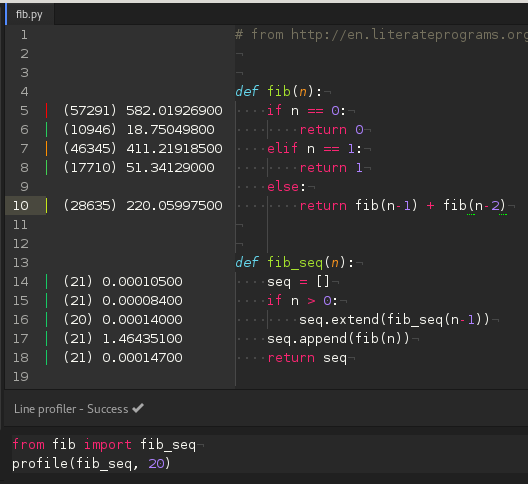

# Python line profiler for Atom



# Requirements

* line_profiler fork (for now)
https://github.com/iddl/line_profiler

```
git clone https://github.com/iddl/line_profiler.git
cd line_profiler
python setup.py install
```

# How to run
1) ALT+SHIFT+P to activate

This will show a snippet similar to the following

```
# call function to profile here
profile(function_to_profile, args, kwargs)
```

2) Run the function to profile (`profile(myfunction, args, kwargs)`)

3) Stats will appear in the editor gutter
